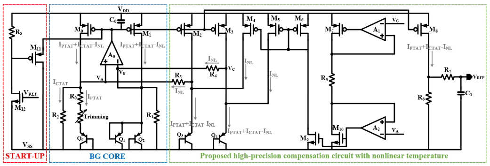
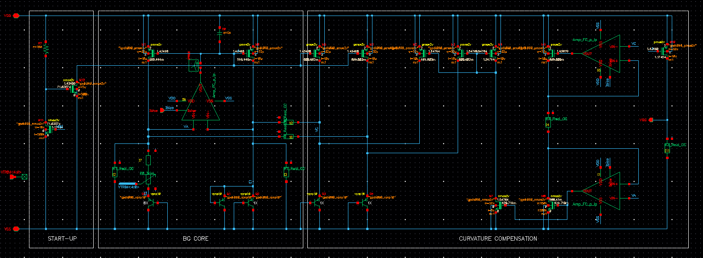
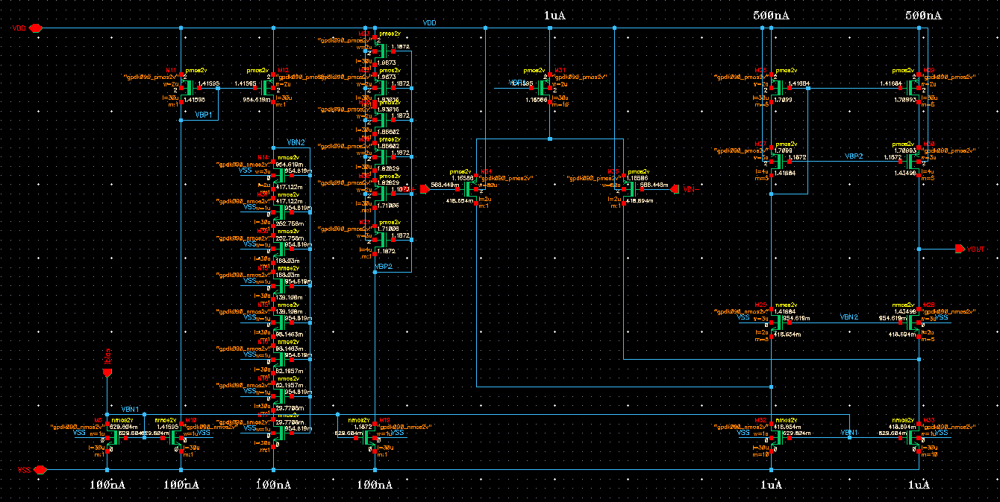
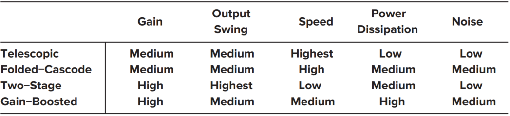
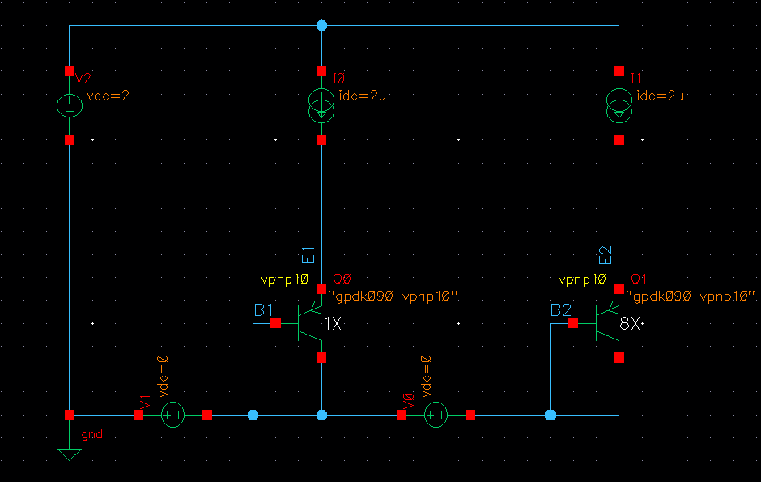
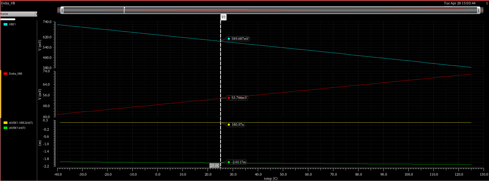

# DESIGN OF BANDGAP REFERENCE WITH NONLINEAR TEMPERATURE COMPENSATION USING GPDK 90NM TECHNOLOGY
**Authors:** Nguyen Quoc Huy    

**Organization:** Hanoi University of Industry  

**Tool:** Cadence Virtuoso 

**Technology/Process:** 90nm  

**Project Duration:** February, 2026 to March, 2026  

## Abstract  
This project presents the design and vertification of high-performance CMOS Bandgap Reference (BGR) aimed at providing a stable 1.2V output. By intergrating advanced higher-order curvature correction, the architecture achieves a superior temperature coefficient, ensuring high precision across varying thermal conditions.
## 1. Introduction  
Bandgap Reference (BGR) circuits are critical modules in most integrated circuit systems and are widely used in analog circuits, digital circuits, and mixed-signal circuits such as memory circuits, A/D converters, and low dropout linear regulators. BGR circuits provide temperature-independent voltage or currents for the system-on-a-chip (SoC), and their performance determines the quality of the entire SoC. With the development of the CMOS process, the feature size of integrated circuits continues to decrease, and the operation voltage of the electronic system is becoming increasingly lower. Low-voltage and high-precision BGR circuit have received widespread attention.  
The operational framework of a BGR is based on merging two distinct voltage characterized by contrasting thermal behaviors. A voltage linked to the base-emitter voltage ($\mathrm{V_{BE}}$) of a bipolar junction transistor (BJT), which displays a Complementary to Absolute Temperature (CTAT) coefficient, and a derived from the $\mathrm{V_{BE}}$ variance ($\Delta \mathrm{V_{BE}}$) between two BJTs running at different current densities, exhibiting a Proportional to Absolute Temperature (PTAT) coefficient. By mathematically balancing these two components, a Zero-Temperature-Coefficient (ZTC) voltage can be established at a targeted temperature point. Furthermore, this work proposes an optimized BGR architecture specifically aimed at suppressing high order nonlinear temperature components to achieve superior precision.
## 2. Design Specification  
The target pergormance metrics for the Bandgap Reference are ourlined in Table 1. The design was required to operate reliably across the Process, Voltage and Temperature (PVT) corners detailed in Table 2.
### Specification  
| Parameter   | Min    | Typ   | Max    | Unit   | Notes                                                                               |
|:------------|:-------|:------|:-------|:-------|:------------------------------------------------------------------------------------|
| VDD         | 1.8    | 2     | 2.2    | V      |                                                                                     |
| Temp        | -40    | 25    | 125    | C      |                                                                                     |
| VBG         | 1.188  | 1.2   | 1.212  | V      |                                                                                     |
| Temp Co.    |        |       | 20     | ppm/°C |                                                                                     |
| Iq          |        | 50u   | 100u   | A      |                                                                                     |
| PSR (DC)    |        |       | -60    | dB     |                                                                                     |
| PSR (10k)   |        |       | -40    | dB     |                                                                                     |
| Function    |        |       |        |        | Startup, Curvature compensation, Trimming for process variation                     |  

**Table 1: Design Specification for the Bandgap Reference.**    

### Corner Setting  
|               | P             | V              | T         |
|---------------|---------------|----------------|-----------|
| **MOS**       | SS SF FS FF   |                |           |
| **BJT**       | SS FF         | 2V +/-10%      | -40 125   |
| **RES**       | SS FF         | 2V +/-10%      | -40 125   |
| **CAP**       | SS FF         |                |           |
| **MONTE CARLO** | Process + Mismatch |         |           |  

**Table 2: Corner Setting across Process, Voltage and Temperature (PVT).**

## 3. Circuit Architecture and Implementation
An optimized architecture, integrating multiple high-performance techniques, was chosen to fulfill the demanding technical requirements. Figure 1(a) depicts the fundamental block diagram of this proposed BGR.  
  
**Figure 1(a): Overall BGR Block Diagram showing key functional blocks.**  

To further eliminate high-order temperature terms, a BGR circuit incorporating curvature compensation is designed, as illustrated in Figure 1(b). The primary elements and methodologies are explored in the following sections.

**Figure 1(b): Overall BGR Block Diagram showing key functional blocks.**  

### 3.1. Error Amplifier  
Since the base-emitter voltage ($\mathrm{V_{BE}}$) typically operates around 0.7V, a PMOS-input differential pair is preferred to accommodate this low common-mode input level. The primary role of this amplifier is to equalize the currents in the two core branches containing Q0 and Q2, there by ensuring precision. Consequently, a PMOS-input folded-cascode amplifier was selected, as depicted in Figure 2.  

  
**Figure 2: Error Amplifier schematic: PMOS-input Folded Cascode Amplifier**  

The folded-cascode topology provides high gain and good PSRR in a single stage, as summarized in the comparison table (Figure 3).  

**Figure 3: Comparison of different amplifier topologies**  

### 3.2. Curvature Compensation
The underlying mechanism of a bandgap reference involves the synthesis of a zero temperature coefficient (ZTC) output. This is accomplished by aggregating two voltage elements with inverse thermal characteristics: a Complementary to Absolute Temperature (CTAT) component and a Proportional to Absolute Temperature (PTAT) component.  
### 3.2.1. First-Order Temperature Compensation  
The CTAT part is the base-emitter voltage, $\mathrm{V_{BE}}$, which drops as temperature rises. In cntrast, the PTAT part comes from the $\mathrm{V_{BE}}$ difference between two transistors with different current densities, called $\Delta \mathrm{V_{BE}}$: 

$$
\mathrm{V_{CTAT}(T) = V_{BE}(T)}
$$  

$$
\mathrm{V_{PTAT}(T) = \Delta V_{BE} = V_T \ln(N) = \frac{kT}{q} \ln(N)}
$$  

We have:  

$$
\mathrm{I_{REF} = \frac{v_T \ln N}{R_0} + \frac{V_{EB1}}{R_{1,2}} = \frac{kT}{q R_0} \ln N + \frac{V_{EB1}}{R_{1,2}}}
$$  

Then, a low reference voltage $\mathrm{V_{REF}}$ can be generated and expressed as  

$$
\mathrm{V_{REF} = I_{REF} R_6 = \left( \frac{\Delta V_{EB}}{R_0} + \frac{V_{EB1}}{R_{1,2}} \right) R_6}
$$  

By choosing the resistor ratio appriately, the negative temperature coefficient of $\mathrm{V_{BE}}$ can be cancelled by the positive coefficient of $\mathrm{V_T ln(N)}$, achieving a first-order ZTC reference.
### 3.2.2. The Origin of Curvature
An accurate analysis of the temperature effects on $\mathrm{V_{BE}}$-T characteristics can be expressed as  

$$
\mathrm{V_{EB}(T) = V_{G0}(T_r) + \left( \frac{T}{T_r} \right) [V_{EB}(T_r) - V_{G0}(T_r)] - (n - \delta) \frac{kT}{q} \ln \left( \frac{T}{T_r} \right)}
$$  

Where $\mathrm{V_{G0}(T_r)}$ is the bandgap voltage of silicon at the reference temperature $\mathrm{T_r}$, n is a temperature-independent and process-dependent constant around 4, and $\mathrm{\delta}$ is a factor of the temperature dependent on the collector current, which is equal to 1 if the current in the BJT is PTAT and becomes 0 when the current is temperature-independent. $\mathrm{V_{T}}$ is the thermal voltage, k is Boltzmann's constant, q is the electric charge and n is the ratio of emitter areas.  

  
**Figure 4: Calculate Slope of $\mathrm{V_{BE}}$ and $\Delta \mathrm{V_{BE}}$.**  

  
**Figure 5: Slope of Slope of $\mathrm{V_{BE}}$ and $\Delta \mathrm{V_{BE}}$**   

$$
\mathrm{V_{BE}} = 589.687mV; \quad \Delta \mathrm{V_{BE}} = 53.766mV; \quad \mathrm{K}.\Delta \mathrm{V_{BE}} + \mathrm{V_{BE}} = 1.2V; \quad \mathrm{K} \approx 11.35
$$  

The first two parts of the equation show the main downward slope.  

However, the last past, $\mathrm{(n - \delta) \frac{kT}{q} \ln \left( \frac{T}{T_r} \right)}$, is higher-order nonlinear temperature. Even when we cancel out the linear parts in the BGR, this nonlinear part stays behind. This creats a curvature in the graph of $\mathrm{V_{REF}}$ against temperature, which stops the circuit from being perfectly stable over a wide heat range.  
### 3.2.3. Implementation of Curvature Correction
